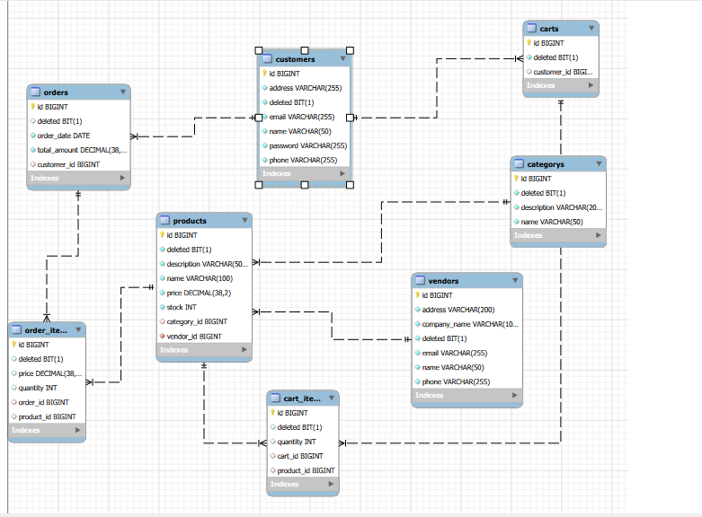

# E-Commerce Backend REST API Application

A comprehensive Spring Boot backend application for an E-Commerce platform. It manages customers, vendors, product categories, products, shopping carts, cart items, customer orders, and order line items. The project uses Spring Data JPA for object-relational mapping with MySQL database, incorporates Spring Caching for enhanced performance, provides pagination/sorting capabilities, and implements centralized global exception handling.

---

## Technical Specifications and Tech Stack

- Java Version: 17
- Framework: Spring Boot 4.1.0
- Build Tool: Apache Maven
- Web Module: Spring Boot Starter Web (REST Services)
- Database: MySQL Server (Database Name: `ecommerce_data`)
- ORM / Data Layer: Spring Data JPA / Hibernate (`spring.jpa.hibernate.ddl-auto=update`)
- Caching: Spring Boot Starter Cache & Spring Data Redis support (`@EnableCaching`)
- Boilerplate Reduction: Project Lombok (`@Data`, `@AllArgsConstructor`, `@NoArgsConstructor`)
- Validation: Spring Boot Starter Validation
- Server Port: 8083
- Base URL: `http://localhost:8083`

---

## Project Architecture and Directory Structure

```text
com.example.Ecommerce
│
├── ClassDto
│   ├── CartDTO.java
│   ├── CartItemDTO.java
│   ├── CategoryDTO.java
│   ├── CustomerDTO.java
│   ├── OrderItemDTO.java
│   ├── OrdersDTO.java
│   ├── ProductDTO.java
│   ├── ResourceNotFoundError.java
│   └── VendorDTO.java
│
├── controller
│   ├── CartController.java
│   ├── CartItemController.java
│   ├── CategoryController.java
│   ├── CustomerController.java
│   ├── OrderItemController.java
│   ├── OrdersController.java
│   ├── ProductController.java
│   └── VendorController.java
│
├── entity
│   ├── CartItems.java
│   ├── Carts.java
│   ├── Categorys.java
│   ├── Customers.java
│   ├── OrderItems.java
│   ├── Orders.java
│   ├── Products.java
│   └── Vendors.java
│
├── exception
│   ├── GlobalExceptions.java
│   └── ResourceNotFoundException.java
│
├── repository
│   ├── CartItemRepository.java
│   ├── CartRepository.java
│   ├── CategoryRepository.java
│   ├── CustomerRepository.java
│   ├── OrderItemRepository.java
│   ├── OrdersRepository.java
│   ├── ProductRepository.java
│   └── VendorRepository.java
│
├── service
│   ├── CartItemService.java
│   ├── CartService.java
│   ├── CategoryService.java
│   ├── CustomerService.java
│   ├── OrderItemService.java
│   ├── OrdersService.java
│   ├── ProductService.java
│   └── VendorService.java
│
└── EcommerceApplication.java
```

---

## Database Configuration

Update `src/main/resources/application.properties` with your database credentials before running:

```properties
spring.application.name=Ecommerce
server.port=8083

# MySQL Configuration
spring.datasource.url=jdbc:mysql://localhost:3306/ecommerce_data
spring.datasource.username=root
spring.datasource.password=your_password
spring.datasource.driver-class-name=com.mysql.cj.jdbc.Driver

# Hibernate Configuration
spring.jpa.hibernate.ddl-auto=update
spring.jpa.show-sql=true
spring.jpa.properties.hibernate.format_sql=true
spring.cache.type=simple
```

---

## Database Schema and Entity Relationship Diagram (ERD)

### Database Diagram



---

### Database Table Schemas

#### 1. `customers` Table
| Column Name | Data Type | Constraints | Description |
|---|---|---|---|
| `id` | BIGINT | PRIMARY KEY, AUTO_INCREMENT | Customer unique identifier |
| `address` | VARCHAR(255) | NULLABLE | Customer address |
| `deleted` | BIT(1) | DEFAULT FALSE | Soft delete flag |
| `email` | VARCHAR(255) | NULLABLE | Customer email address |
| `name` | VARCHAR(50) | NULLABLE | Customer full name |
| `password` | VARCHAR(255) | NULLABLE | Encrypted/plain user password |
| `phone` | VARCHAR(255) | NULLABLE | Customer phone number |

#### 2. `vendors` Table
| Column Name | Data Type | Constraints | Description |
|---|---|---|---|
| `id` | BIGINT | PRIMARY KEY, AUTO_INCREMENT | Vendor unique identifier |
| `address` | VARCHAR(200) | NULLABLE | Vendor physical address |
| `company_name` | VARCHAR(100) | NULLABLE | Vendor registered company name |
| `deleted` | BIT(1) | DEFAULT FALSE | Soft delete flag |
| `email` | VARCHAR(255) | NULLABLE | Vendor contact email |
| `name` | VARCHAR(50) | NULLABLE | Vendor contact person name |
| `phone` | VARCHAR(255) | NULLABLE | Vendor phone number |

#### 3. `categorys` Table
| Column Name | Data Type | Constraints | Description |
|---|---|---|---|
| `id` | BIGINT | PRIMARY KEY, AUTO_INCREMENT | Category unique identifier |
| `deleted` | BIT(1) | DEFAULT FALSE | Soft delete flag |
| `description` | VARCHAR(200) | NULLABLE | Category description |
| `name` | VARCHAR(50) | NULLABLE | Category name |

#### 4. `products` Table
| Column Name | Data Type | Constraints | Description |
|---|---|---|---|
| `id` | BIGINT | PRIMARY KEY, AUTO_INCREMENT | Product unique identifier |
| `deleted` | BIT(1) | DEFAULT FALSE | Soft delete flag |
| `description` | VARCHAR(500) | NULLABLE | Detailed product description |
| `name` | VARCHAR(100) | NULLABLE | Product name |
| `price` | DECIMAL(38,2) | NULLABLE | Product unit price |
| `stock` | INT | NULLABLE | Available inventory stock count |
| `category_id` | BIGINT | FOREIGN KEY (`categorys.id`) | Foreign Key to Category |
| `vendor_id` | BIGINT | FOREIGN KEY (`vendors.id`) | Foreign Key to Vendor |

#### 5. `carts` Table
| Column Name | Data Type | Constraints | Description |
|---|---|---|---|
| `id` | BIGINT | PRIMARY KEY, AUTO_INCREMENT | Cart unique identifier |
| `deleted` | BIT(1) | DEFAULT FALSE | Soft delete flag |
| `customer_id` | BIGINT | FOREIGN KEY (`customers.id`) | Foreign Key to Customer |

#### 6. `cart_items` Table
| Column Name | Data Type | Constraints | Description |
|---|---|---|---|
| `id` | BIGINT | PRIMARY KEY, AUTO_INCREMENT | Cart item unique identifier |
| `deleted` | BIT(1) | DEFAULT FALSE | Soft delete flag |
| `quantity` | INT | NULLABLE | Item quantity in cart |
| `cart_id` | BIGINT | FOREIGN KEY (`carts.id`) | Foreign Key to Cart |
| `product_id` | BIGINT | FOREIGN KEY (`products.id`) | Foreign Key to Product |

#### 7. `orders` Table
| Column Name | Data Type | Constraints | Description |
|---|---|---|---|
| `id` | BIGINT | PRIMARY KEY, AUTO_INCREMENT | Order unique identifier |
| `deleted` | BIT(1) | DEFAULT FALSE | Soft delete flag |
| `order_date` | DATE | NULLABLE | Date order was placed |
| `total_amount` | DECIMAL(38,2) | NULLABLE | Total price of the order |
| `customer_id` | BIGINT | FOREIGN KEY (`customers.id`) | Foreign Key to Customer |

#### 8. `order_items` Table
| Column Name | Data Type | Constraints | Description |
|---|---|---|---|
| `id` | BIGINT | PRIMARY KEY, AUTO_INCREMENT | Order item unique identifier |
| `deleted` | BIT(1) | DEFAULT FALSE | Soft delete flag |
| `price` | DECIMAL(38,2) | NULLABLE | Price at purchase time |
| `quantity` | INT | NULLABLE | Quantity of product purchased |
| `order_id` | BIGINT | FOREIGN KEY (`orders.id`) | Foreign Key to Order |
| `product_id` | BIGINT | FOREIGN KEY (`products.id`) | Foreign Key to Product |

---

## Complete API Endpoints Reference with Full Localhost URLs

---

### 1. Customer Endpoints (`http://localhost:8083/customer`)

#### Create Customer (POST)
- HTTP Method: `POST`
- Full URL: `http://localhost:8083/customer`
- Request Body (JSON):
```json
{
  "name": "John Doe",
  "email": "john.doe@example.com",
  "password": "Password123",
  "phone": "9876543210",
  "address": "123 Main Street, Cityville"
}
```
- Result (JSON):
```json
{
  "id": 1,
  "name": "John Doe",
  "email": "john.doe@example.com",
  "password": "Password123",
  "phone": "9876543210",
  "address": "123 Main Street, Cityville"
}
```

#### Get All Customers (GET)
- HTTP Method: `GET`
- Full URL: `http://localhost:8083/customer`

#### Get Customer By ID (GET)
- HTTP Method: `GET`
- Full URL: `http://localhost:8083/customer/{id}`

#### Update Customer (PUT)
- HTTP Method: `PUT`
- Full URL: `http://localhost:8083/customer/{id}`
- Request Body (JSON):
```json
{
  "name": "John Doe Updated",
  "email": "john.updated@example.com",
  "password": "NewPassword123",
  "phone": "9876543210",
  "address": "456 Oak Avenue, Cityville"
}
```
- Result (JSON):
```json
{
  "id": 1,
  "name": "John Doe Updated",
  "email": "john.updated@example.com",
  "password": "NewPassword123",
  "phone": "9876543210",
  "address": "456 Oak Avenue, Cityville"
}
```

#### Delete Customer (DELETE)
- HTTP Method: `DELETE`
- Full URL: `http://localhost:8083/customer/{id}`
- Response: `"Customer Deleted Successfully"`

#### Sort Customers (GET)
- HTTP Method: `GET`
- Full URL: `http://localhost:8083/customer/sort/{field}` (Example: `http://localhost:8083/customer/sort/name`)

#### Paginate Customers (GET)
- HTTP Method: `GET`
- Full URL: `http://localhost:8083/customer/page?page=0&size=10`

---

### 2. Vendor Endpoints (`http://localhost:8083/vendor`)

#### Create Vendor (POST)
- HTTP Method: `POST`
- Full URL: `http://localhost:8083/vendor`
- Request Body (JSON):
```json
{
  "name": "Robert Smith",
  "companyName": "Tech Distribution Ltd",
  "email": "contact@techdist.com",
  "phone": "1122334455",
  "address": "789 Supply Chain Road, Warehouse District"
}
```
- Result (JSON):
```json
{
  "id": 1,
  "name": "Robert Smith",
  "companyName": "Tech Distribution Ltd",
  "email": "contact@techdist.com",
  "phone": "1122334455",
  "address": "789 Supply Chain Road, Warehouse District"
}
```

#### Get All Vendors (GET)
- HTTP Method: `GET`
- Full URL: `http://localhost:8083/vendor`

#### Get Vendor By ID (GET)
- HTTP Method: `GET`
- Full URL: `http://localhost:8083/vendor/{id}`

#### Update Vendor (PUT)
- HTTP Method: `PUT`
- Full URL: `http://localhost:8083/vendor/{id}`

#### Delete Vendor (DELETE)
- HTTP Method: `DELETE`
- Full URL: `http://localhost:8083/vendor/{id}`
- Response: `"Vendor Deleted Successfully"`

#### Sort Vendors (GET)
- HTTP Method: `GET`
- Full URL: `http://localhost:8083/vendor/sort/{field}`

#### Paginate Vendors (GET)
- HTTP Method: `GET`
- Full URL: `http://localhost:8083/vendor/page?page=0&size=10`

---

### 3. Category Endpoints (`http://localhost:8083/category`)

#### Create Category (POST)
- HTTP Method: `POST`
- Full URL: `http://localhost:8083/category`
- Request Body (JSON):
```json
{
  "name": "Electronics",
  "description": "Smartphones, laptops, and peripheral hardware"
}
```
- Result (JSON):
```json
{
  "id": 1,
  "name": "Electronics",
  "description": "Smartphones, laptops, and peripheral hardware"
}
```

#### Get All Categories (GET)
- HTTP Method: `GET`
- Full URL: `http://localhost:8083/category`

#### Get Category By ID (GET)
- HTTP Method: `GET`
- Full URL: `http://localhost:8083/category/{id}`

#### Update Category (PUT)
- HTTP Method: `PUT`
- Full URL: `http://localhost:8083/category/{id}`

#### Delete Category (DELETE)
- HTTP Method: `DELETE`
- Full URL: `http://localhost:8083/category/{id}`
- Response: `"Category Deleted Successfully"`

#### Sort Categories (GET)
- HTTP Method: `GET`
- Full URL: `http://localhost:8083/category/sort/{field}`

#### Paginate Categories (GET)
- HTTP Method: `GET`
- Full URL: `http://localhost:8083/category/page?page=0&size=10`

---

### 4. Product Endpoints (`http://localhost:8083/product`)

#### Create Product (POST)
- HTTP Method: `POST`
- Full URL: `http://localhost:8083/product`
- Request Body (JSON):
```json
{
  "name": "Wireless Ergonomic Mouse",
  "description": "High-precision 2.4GHz optical gaming mouse",
  "price": 29.99,
  "stock": 100,
  "categoryId": 1,
  "vendorId": 1
}
```
- Result (JSON):
```json
{
  "id": 1,
  "name": "Wireless Ergonomic Mouse",
  "description": "High-precision 2.4GHz optical gaming mouse",
  "price": 29.99,
  "stock": 100,
  "categoryId": 1,
  "categoryName": "Electronics",
  "vendorId": 1,
  "vendorName": "Robert Smith"
}
```

#### Get All Products (GET)
- HTTP Method: `GET`
- Full URL: `http://localhost:8083/product`

#### Get Product By ID (GET)
- HTTP Method: `GET`
- Full URL: `http://localhost:8083/product/{id}`

#### Update Product (PUT)
- HTTP Method: `PUT`
- Full URL: `http://localhost:8083/product/{id}`

#### Delete Product (DELETE)
- HTTP Method: `DELETE`
- Full URL: `http://localhost:8083/product/{id}`
- Response: `"Product Deleted Successfully"`

#### Search Products By Name (GET)
- HTTP Method: `GET`
- Full URL: `http://localhost:8083/product/search?name=Mouse`

#### Sort Products (GET)
- HTTP Method: `GET`
- Full URL: `http://localhost:8083/product/sort/{field}`

#### Paginate Products (GET)
- HTTP Method: `GET`
- Full URL: `http://localhost:8083/product/page?page=0&size=10`

---

### 5. Cart Endpoints (`http://localhost:8083/cart`)

#### Create Cart (POST)
- HTTP Method: `POST`
- Full URL: `http://localhost:8083/cart`
- Request Body (JSON):
```json
{
  "customerId": 1
}
```
- Result (JSON):
```json
{
  "id": 1,
  "customerId": 1
}
```

#### Get All Carts (GET)
- HTTP Method: `GET`
- Full URL: `http://localhost:8083/cart`

#### Get Cart By ID (GET)
- HTTP Method: `GET`
- Full URL: `http://localhost:8083/cart/{id}`

#### Delete Cart (DELETE)
- HTTP Method: `DELETE`
- Full URL: `http://localhost:8083/cart/{id}`
- Response: `"Cart Deleted Successfully"`

---

### 6. Cart Item Endpoints (`http://localhost:8083/cartitem`)

#### Create Cart Item (POST)
- HTTP Method: `POST`
- Full URL: `http://localhost:8083/cartitem`
- Request Body (JSON):
```json
{
  "quantity": 2,
  "cartId": 1,
  "productId": 1
}
```
- Result (JSON):
```json
{
  "id": 1,
  "quantity": 2,
  "cartId": 1,
  "productId": 1
}
```

#### Get All Cart Items (GET)
- HTTP Method: `GET`
- Full URL: `http://localhost:8083/cartitem`

#### Get Cart Item By ID (GET)
- HTTP Method: `GET`
- Full URL: `http://localhost:8083/cartitem/{id}`

#### Update Cart Item (PUT)
- HTTP Method: `PUT`
- Full URL: `http://localhost:8083/cartitem/{id}`

#### Delete Cart Item (DELETE)
- HTTP Method: `DELETE`
- Full URL: `http://localhost:8083/cartitem/{id}`
- Response: `"Cart Item Deleted Successfully"`

#### Paginate Cart Items (GET)
- HTTP Method: `GET`
- Full URL: `http://localhost:8083/cartitem/page?page=0&size=10`

---

### 7. Orders Endpoints (`http://localhost:8083/orders`)

#### Create Order (POST)
- HTTP Method: `POST`
- Full URL: `http://localhost:8083/orders`
- Request Body (JSON):
```json
{
  "orderDate": "2026-07-23",
  "totalAmount": 59.98,
  "customerId": 1
}
```
- Result (JSON):
```json
{
  "id": 1,
  "orderDate": "2026-07-23",
  "totalAmount": 59.98,
  "customerId": 1
}
```

#### Get All Orders (GET)
- HTTP Method: `GET`
- Full URL: `http://localhost:8083/orders`

#### Get Order By ID (GET)
- HTTP Method: `GET`
- Full URL: `http://localhost:8083/orders/{id}`

#### Delete Order (DELETE)
- HTTP Method: `DELETE`
- Full URL: `http://localhost:8083/orders/{id}`
- Response: `"Order Deleted Successfully"`

---

### 8. Order Item Endpoints (`http://localhost:8083/orderitem`)

#### Create Order Item (POST)
- HTTP Method: `POST`
- Full URL: `http://localhost:8083/orderitem`
- Request Body (JSON):
```json
{
  "quantity": 2,
  "price": 29.99,
  "orderId": 1,
  "productId": 1
}
```
- Result (JSON):
```json
{
  "id": 1,
  "quantity": 2,
  "price": 29.99,
  "orderId": 1,
  "productId": 1
}
```

#### Get All Order Items (GET)
- HTTP Method: `GET`
- Full URL: `http://localhost:8083/orderitem`

#### Get Order Item By ID (GET)
- HTTP Method: `GET`
- Full URL: `http://localhost:8083/orderitem/{id}`

#### Delete Order Item (DELETE)
- HTTP Method: `DELETE`
- Full URL: `http://localhost:8083/orderitem/{id}`
- Response: `"Order Item Deleted Successfully"`

#### Paginate Order Items (GET)
- HTTP Method: `GET`
- Full URL: `http://localhost:8083/orderitem/page?page=0&size=10`

---

## Global Exception Handling

When a requested resource is not found (for instance, an invalid ID is supplied), a structured error payload is returned:

- HTTP Status: `404 NOT FOUND`
- Example Response (JSON):
```json
{
  "time": "2026-07-23T18:30:00",
  "status": 404,
  "message": "Product Not Found : 999"
}
```

---

## Building and Running the Application

### Prerequisites
- Java Development Kit (JDK 17 or higher)
- Apache Maven
- MySQL Database Server running on port 3306

### Execution Steps
1. Create the database in MySQL:
   ```sql
   CREATE DATABASE ecommerce_data;
   ```
2. Navigate to the project directory:
   ```bash
   cd Ecommerce
   ```
3. Build the project using Maven:
   ```bash
   mvn clean install
   ```
4. Run the Spring Boot application:
   ```bash
   mvn spring-boot:run
   ```
   Or run using Maven Wrapper:
   ```bash
   ./mvnw spring-boot:run
   ```
